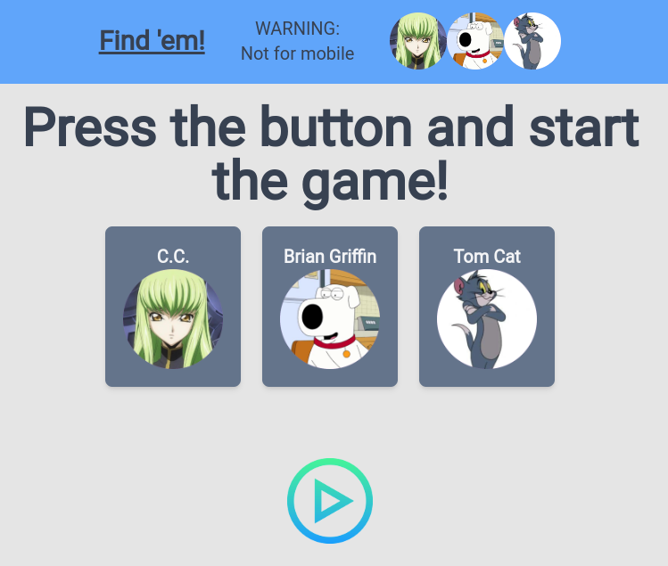
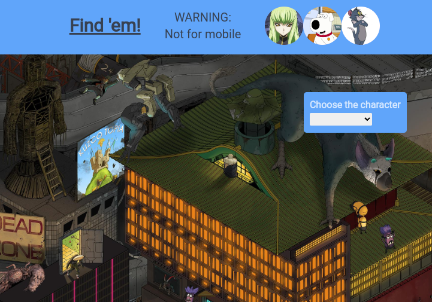

# Where-s-Waldo

# [Live](https://where-s-waldo.vercel.app/game)

In this work in progress project I started working with the beautiful Tailwind CSS.
I had to do a fair bit of googling and trial and error in order to implement the 'find the character' feature.

